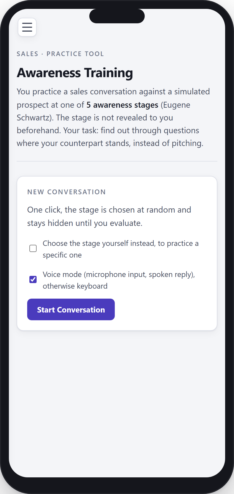
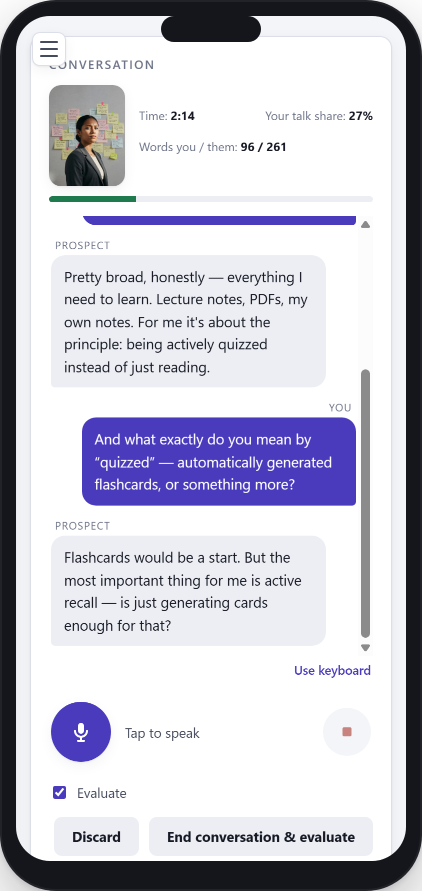
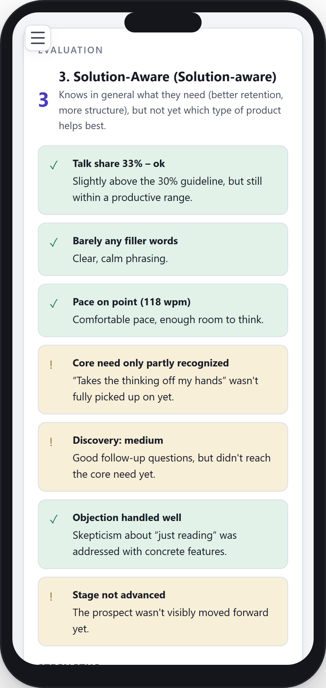
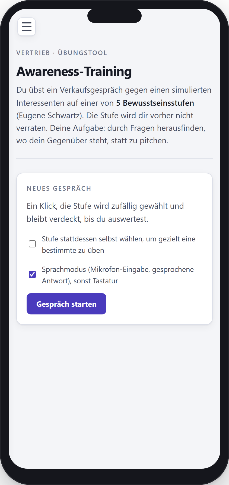
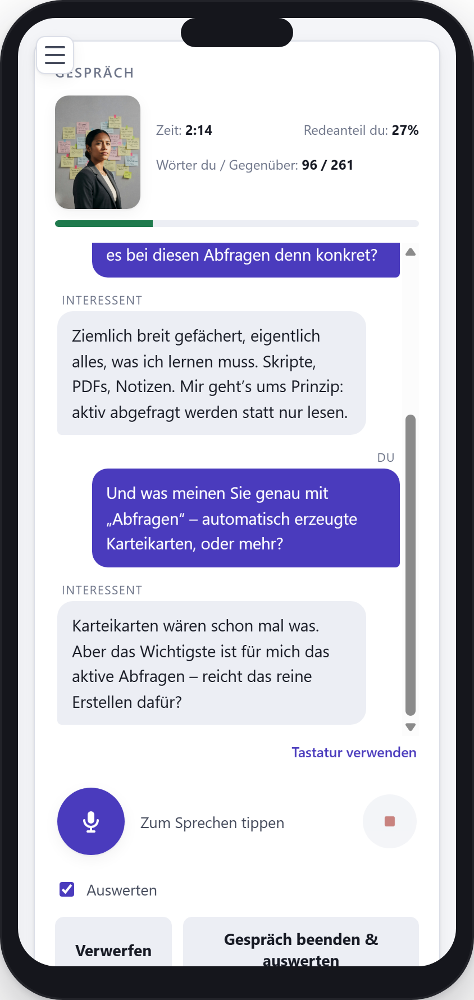
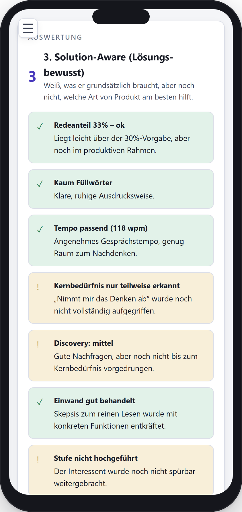

# Sales Awareness Trainer

A single-file, client-side web app for practicing sales conversations against an AI-simulated prospect at one of the **5 stages of awareness** (Eugene Schwartz, *Breakthrough Advertising*, 1966) — without knowing in advance which stage you're talking to.

**[English](#english) · [Deutsch](#deutsch)**

---

## English

### What is this?

A training tool for sales conversations: you practice against an AI-simulated prospect who is randomly (or deliberately) placed at one of 5 stages of awareness — unaware, problem-aware, solution-aware, product-aware, or ready to decide. The stage is not revealed to you beforehand. Your task: find out through questions where your counterpart stands, instead of pitching.

After the conversation, the same AI evaluates your call against a guide (talk share, filler words, pace, discovery depth, objection handling, among others) and gives you one concrete next step.

### Quick Start

  
  
  

1. Open `index.html` in your browser (or host it via GitHub Pages) — no server, no build, no install.
2. Create a free [OpenRouter](https://openrouter.ai/) API key and enter it under **Access** (details below).
3. Click **Start conversation** — the stage is picked at random and stays hidden until you evaluate.
4. After the conversation, get evaluated on talk share, filler words, pace, discovery depth, objection handling, and a concrete next step.

### Features

- 5 awareness stages as roleplay scenarios, random or deliberately selectable (trainer mode)
- Additional behavior variants per stage (defensive/open)
- **Configuration**: stages, personas, and the product briefing are fully editable — adapt the tool to your own product or offer
- Voice mode (microphone input, spoken reply) or keyboard
- Automatic evaluation after every conversation, incl. talk-share tracking (the 30/70 rule)
- Training history with dashboard, PDF export, CSV/JSON export/import
- German/English toggle (UI, roleplay content, and prompts)

### Requirement: an OpenRouter account

The tool calls AI models through [OpenRouter](https://openrouter.ai/). You need to:

1. Create a free account at [openrouter.ai](https://openrouter.ai/)
2. Under **Keys** in the dashboard, generate a new API key (starts with `sk-or-v1-…`)
3. Enter and save that key in the tool under **Access**

OpenRouter bills usage pay-as-you-go directly to your account (typical cost per conversation: low cents, depending on the chosen model). This tool has no server of its own — the key stays exclusively local in your browser (`localStorage`), and every request goes directly from your browser to OpenRouter, nowhere else.

### Usage

Just open `index.html` in a browser (double-click, or host it via GitHub Pages). No server, no build, no install required.

### Privacy

All data (API key, settings, training history) stays exclusively local in your browser (`localStorage`). There is no server component of its own, no analytics or tracking scripts. AI requests (text, voice input/output) go directly to OpenRouter — their [privacy policy](https://openrouter.ai/privacy) applies.

### License

[MIT](LICENSE) — free to use, modify, and redistribute.

### Imprint

Provider of this repository: Falko Guderian. Imprint: [falkoguderian.github.io/BuchTutorLegal](https://falkoguderian.github.io/BuchTutorLegal/)

---

## Deutsch

### Was ist das?

Ein Trainingstool für Verkaufs-/Sales-Gespräche: Du übst gegen einen von einer KI simulierten Interessenten, der sich zufällig (oder gezielt wählbar) auf einer von 5 Bewusstseinsstufen befindet — unbewusst, problem-bewusst, lösungs-bewusst, produkt-bewusst oder entscheidungsbereit. Die Stufe wird dir vorher nicht verraten. Deine Aufgabe: durch Fragen herausfinden, wo dein Gegenüber steht, statt zu pitchen.

Nach dem Gespräch bewertet dieselbe KI dein Gespräch anhand eines Leitfadens (u. a. Redeanteil, Füllwörter, Sprechtempo, Discovery-Tiefe, Umgang mit Einwänden) und gibt dir einen konkreten nächsten Schritt.

### Schnellstart

  
  
  

1. `index.html` im Browser öffnen (oder per GitHub Pages hosten) — kein Server, kein Build, keine Installation.
2. Kostenlosen [OpenRouter](https://openrouter.ai/)-API-Key anlegen und unter **Zugang** eintragen (Details unten).
3. **Gespräch starten** klicken — die Stufe wird zufällig gewählt und bleibt verdeckt, bis du auswertest.
4. Nach dem Gespräch auswerten lassen: Redeanteil, Füllwörter, Tempo, Discovery-Tiefe, Einwandbehandlung und ein konkreter nächster Schritt.

### Funktionen

- 5 Bewusstseinsstufen als Rollenspiel-Szenarien, zufällig oder gezielt wählbar (Trainer-Modus)
- Zusätzliche Verhaltens-Varianten pro Stufe (defensiv/offen)
- **Konfiguration**: Stufen, Personas und das Produkt-Briefing sind vollständig anpassbar — du kannst das Tool auf dein eigenes Produkt/Angebot umstellen
- Sprachmodus (Mikrofon-Eingabe, gesprochene Antwort) oder Tastatur
- Automatische Auswertung nach jedem Gespräch inkl. Redeanteil-Tracking (30/70-Regel)
- Trainingsverlauf mit Dashboard, PDF-Export, CSV/JSON-Export/Import
- Deutsch/Englisch umschaltbar (UI, Rollenspiel-Inhalte und Prompts)

### Voraussetzung: OpenRouter-Account

Das Tool ruft KI-Modelle über [OpenRouter](https://openrouter.ai/) auf. Du brauchst dafür:

1. Einen kostenlosen Account auf [openrouter.ai](https://openrouter.ai/) anlegen
2. Im Dashboard unter **Keys** einen neuen API-Key erzeugen (beginnt mit `sk-or-v1-…`)
3. Diesen Key im Tool unter **Zugang** eintragen und speichern

OpenRouter berechnet die Nutzung pay-as-you-go direkt über deinen Account (übliche Kosten pro Gespräch: Cent-Bereich, je nach gewähltem Modell). Es gibt keinen eigenen Server dieses Tools — der Key bleibt ausschließlich lokal in deinem Browser (`localStorage`) und alle Anfragen gehen direkt von deinem Browser an OpenRouter, sonst nirgendwohin.

### Nutzung

Einfach `index.html` im Browser öffnen (Doppelklick oder per GitHub Pages hosten). Kein Server, kein Build, keine Installation nötig.

### Datenschutz

Alle Daten (API-Key, Einstellungen, Trainingsverlauf) bleiben ausschließlich lokal in deinem Browser (`localStorage`). Es gibt keine eigene Server-Komponente, keine Analyse-/Tracking-Skripte. KI-Anfragen (Text, Sprachein-/ausgabe) gehen direkt an OpenRouter — es gilt deren [Datenschutzerklärung](https://openrouter.ai/privacy).

### Lizenz

[MIT](LICENSE) — frei nutzbar, veränderbar und weiterverbreitbar.

### Impressum

Anbieter dieses Repositories: Falko Guderian. Impressum: [falkoguderian.github.io/BuchTutorLegal](https://falkoguderian.github.io/BuchTutorLegal/)
